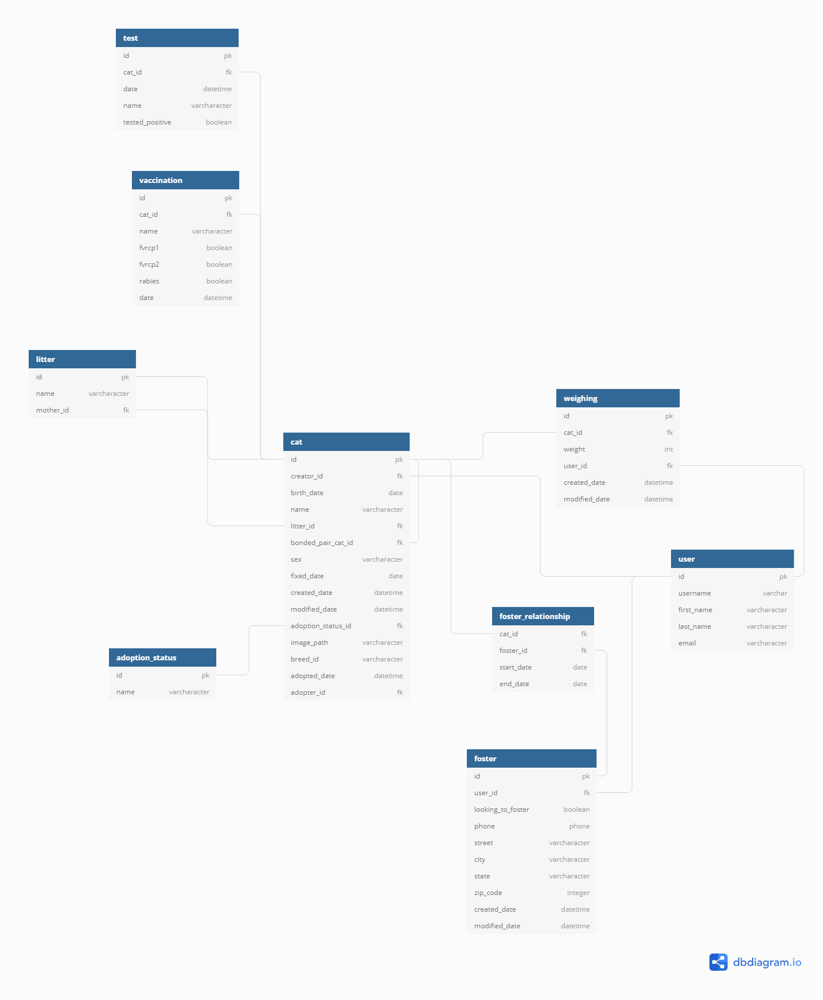

# FOSTERITE Web App

This is the React front-end counterpart to the full-stack Fosterite app. The back-end RESTful API repository is located [here](https://github.com/keithrpotempa/fosterite-api).

Fosterite is a proof-of-concept application for cat fostering organizations. Users can:
- track the status of fostered animals from birth, spaying/neutering, through adoption 
- filter animal lists by adoption status (for instance, to find animals ready for adoption or needing fosters)
- create, update, delete, and view details on individual cats
- register and login
- filter foster lists by "looking to foster"

## Technologies Used
- React (hooks, state, props, routes, components, modules)
- Javascript & JSX
- HTML & CSS
- Material UI
- Moment.js

## Local Setup
If you would like to test this code locally, you can follow these steps to get started:

1. `git clone https://github.com/keithrpotempa/fosterite-web-app && cd fosterite-web-app`
1. `npm install` to build dependencies
1. `npm start` to run the application in development mode
1. Follow the instructions for setting up the back-end API [here](https://github.com/keithrpotempa/fosterite-api).

## Entity Relationship Diagram
